# Settings — Image gallery

Below are categorized screenshots from the Settings folder. Simple tables are used to create small galleries for each category.

## Settings 01 and 02

| Settings 01 | Settings 02 |
|---|---|
| 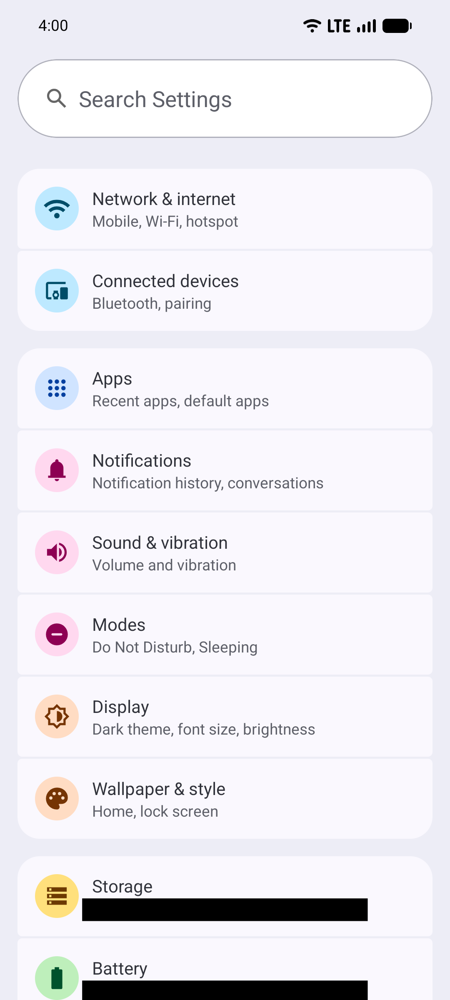 | 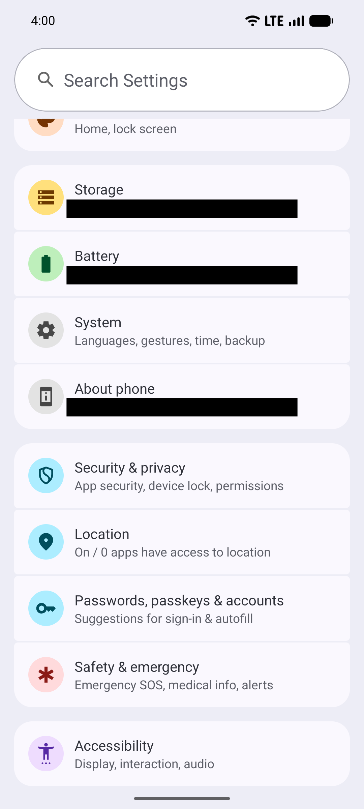 |

## Settings — Network & internet

| Network & internet |
|---|
| 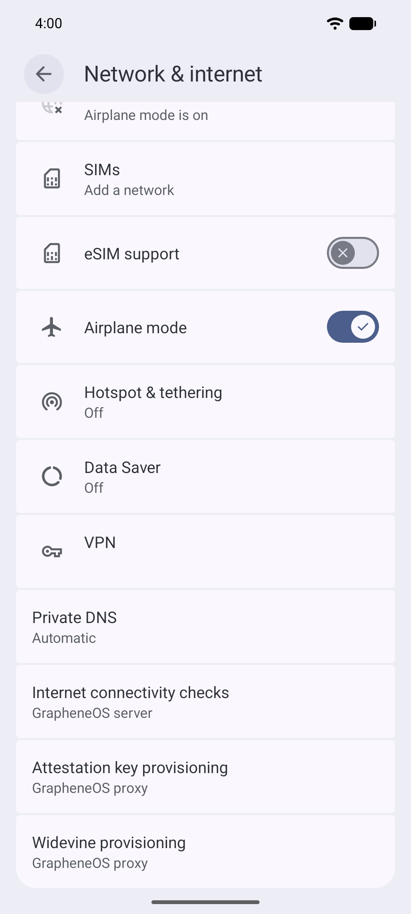 |

## Settings — Wallpaper & style

| Wallpaper 1 | Wallpaper 2 |
|---|---|
| 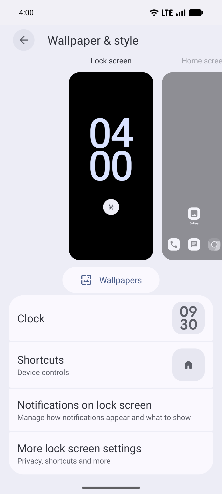 | 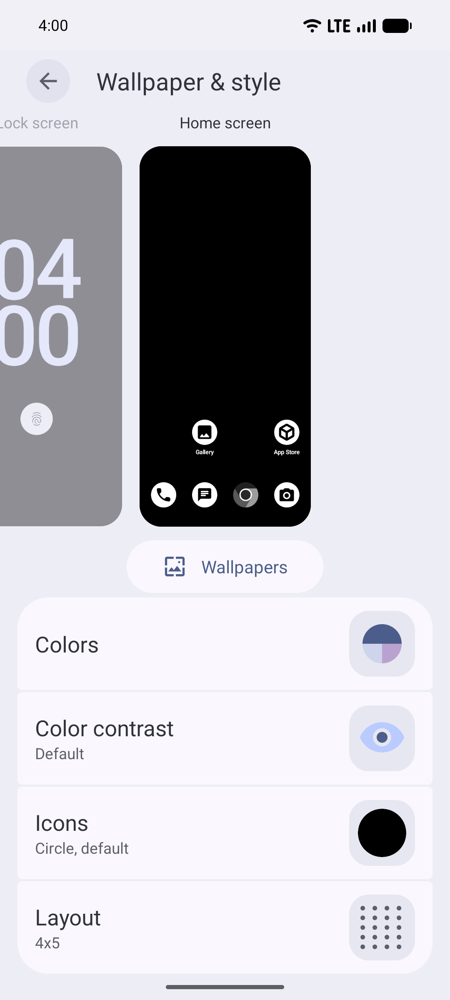 |

## Settings — Security & privacy

|  |  |  |
|---|---|---|
| 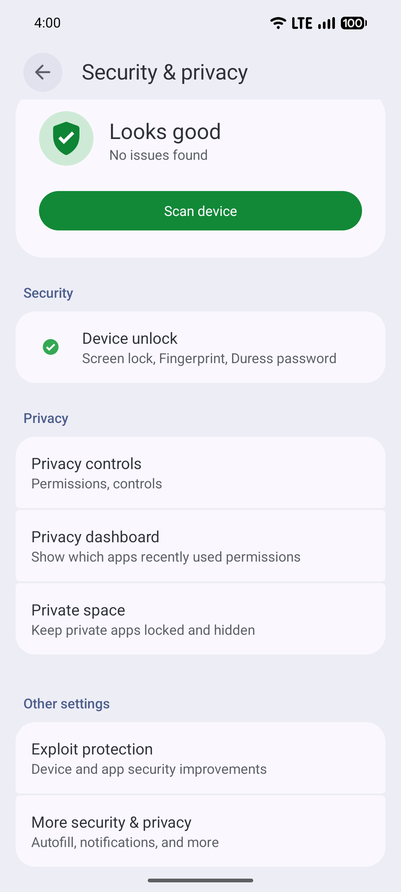 | 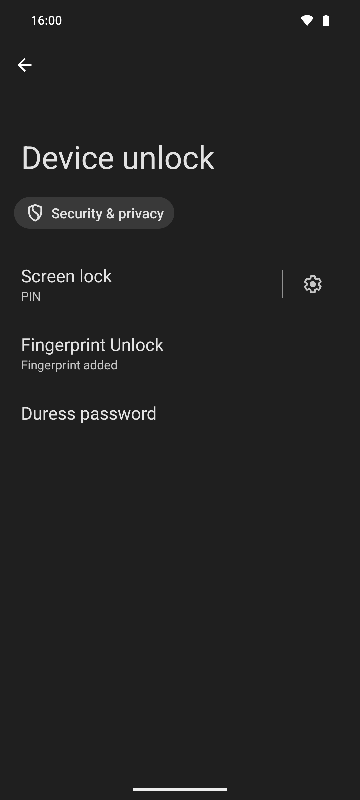 | 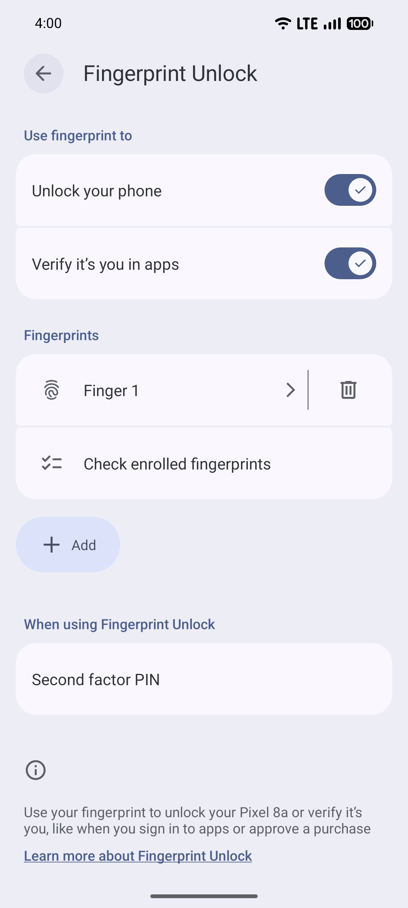 |
| 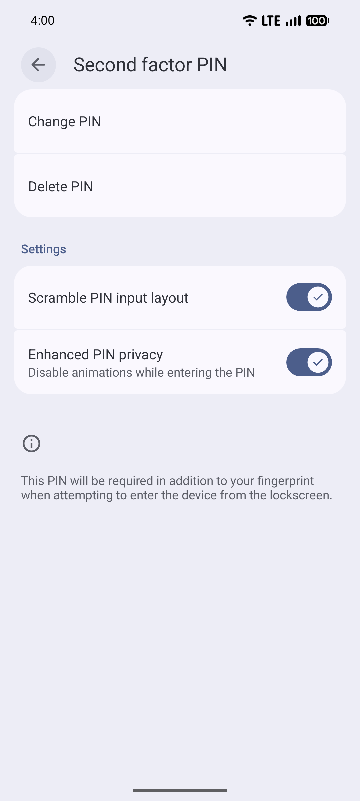 | 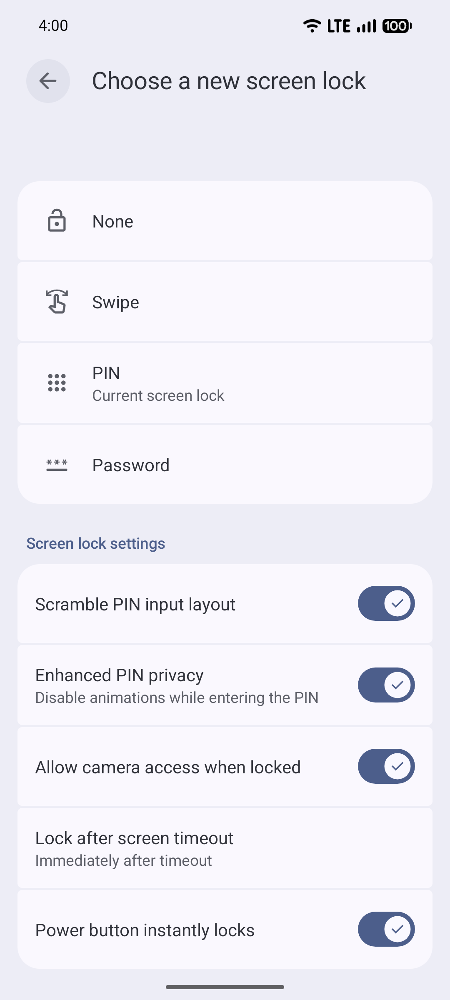 | 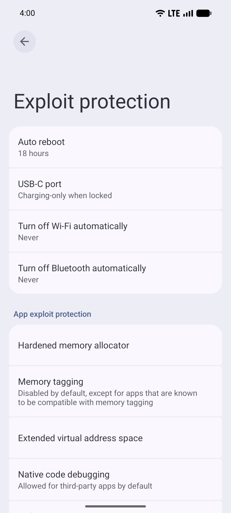 |
| 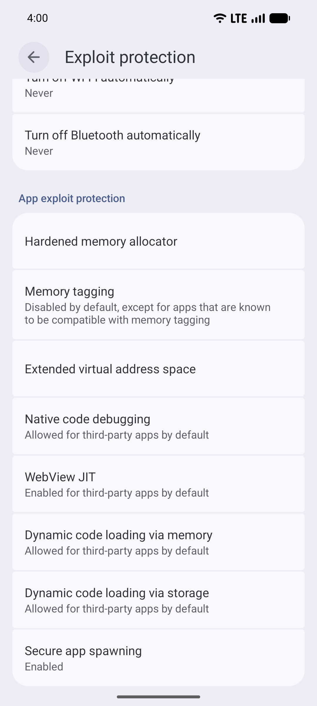 | 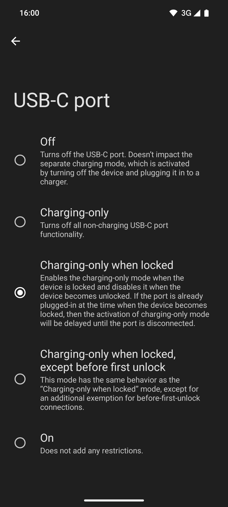 | 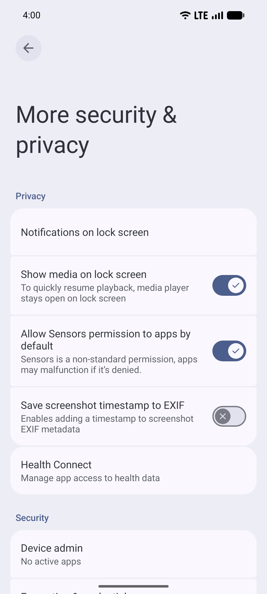 |
| 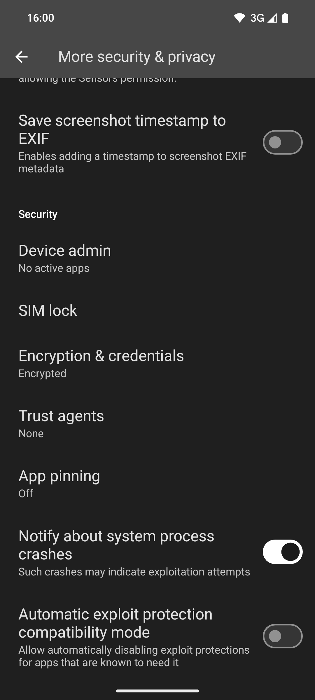 |  |  |

## Settings — Location

|  |  |  |
|---|---|---|
| 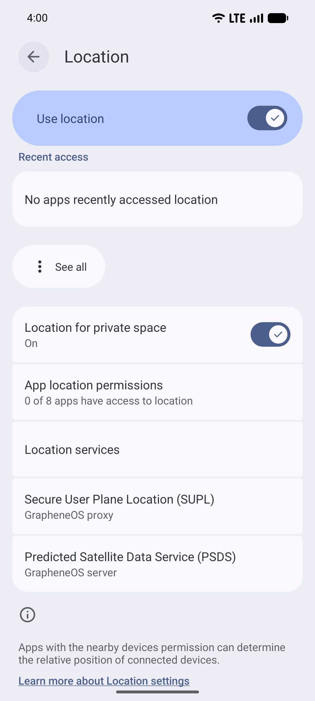 | 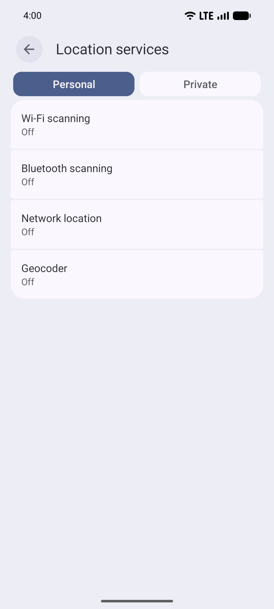 | 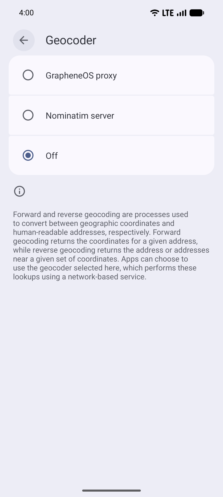 |
| 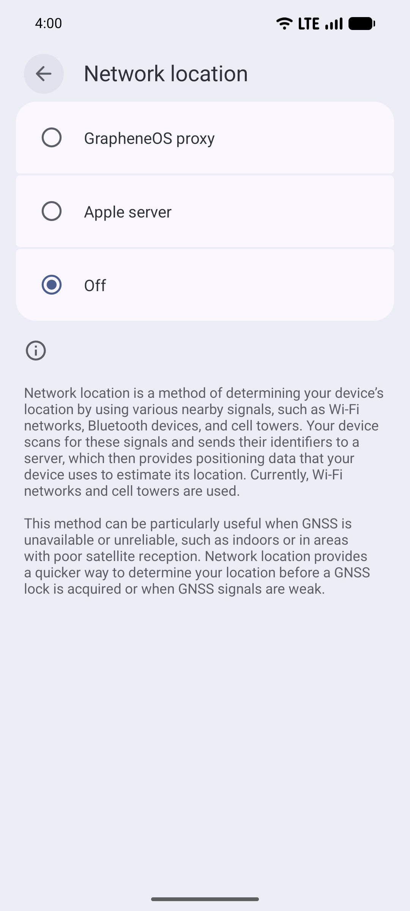 | 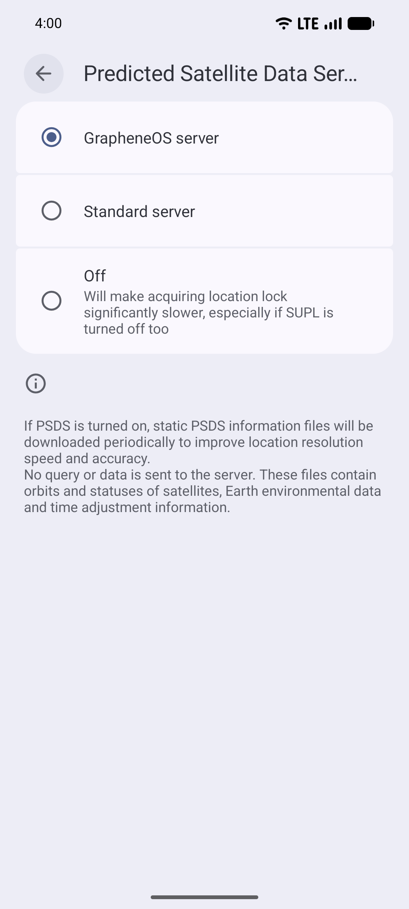 | 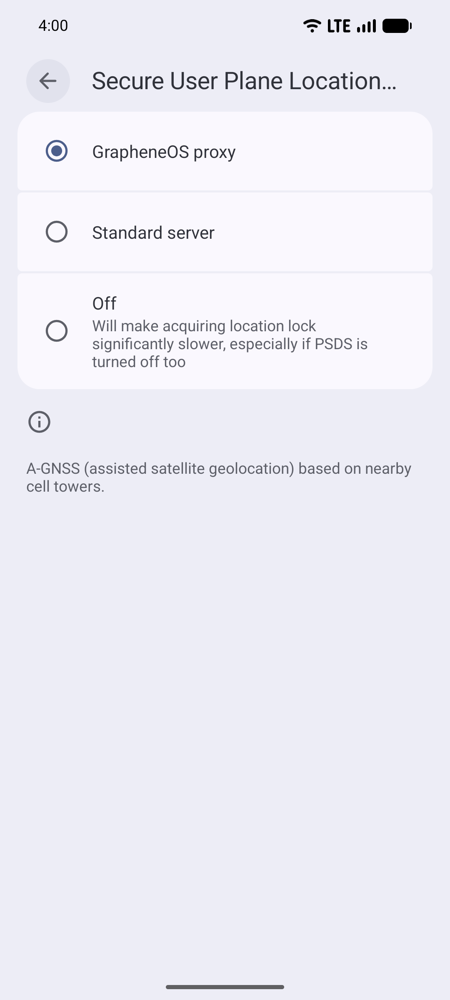 |

---

Images are referenced relative to this README (they are in the same folder). If you want smaller thumbnails, I can add HTML sizing or link each thumbnail to the full-size image.
